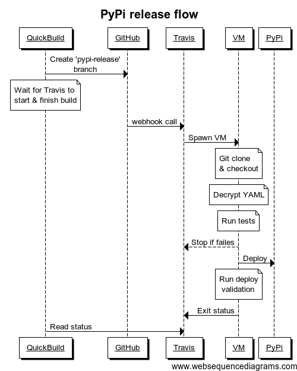

This document describes Cloudify packages release process to PyPi.
And information about how to add additional repositories to the process.

## Release flow

The process is based on Travis CI [Deploy Mechanism](http://docs.travis-ci.com/user/deployment/).
This allows us to deploy packages to a public PyPi repository very easily.
The deployment only takes place if the unit test passed successfully, and certain conditions were met.



### Trigger

At the end of each milestone we trigger deploy by creating branch called `pypi-release`.
After the packages is deployed successfully, we delete the branch.
We trigger with a branch and not a tag because currently Travis has a [known bug](https://github.com/travis-ci/travis-ci/issues/1675) that doesn't allow choosing a specific
tag as a release trigger.

### Credentials

PyPi credentials are being encrypted inside `.travis.yml` using the [Travis Encryption Mechanism](http://docs.travis-ci.com/user/encryption-keys/).
Credentials are being encrypted with an asymmetric encryption, so each repository needs to encrypt/decrypt the keys separately, even if the credentials are the same.
You will need to use the [Travis command line](https://github.com/travis-ci/travis.rb) in order to encrypt your credentials.

### Post deploy

A post deploy script runs after deploy (`travis-utils`) and verifies that the latest sdist is indeed the version that's currently located on PyPi.
This is done because Travis seem to ignore [Certain failures](https://github.com/travis-ci/travis-ci/issues/3058) during the deploy process to PyPi.

See the following reference `.travis.yml` which includes all the flow steps described above:

```yaml
language: python
python:
  - ...
env:
  - ...
install:
  - ...
script:
  - ...
deploy:
  provider: pypi
  server: https://pypi.python.org/pypi
  on:
    branch: pypi-release
    condition: ...
  user:
    secure: ...
  password:
    secure: ...
after_deploy:
  - git clone https://github.com/cloudify-cosmo/travis-utils.git
  - python travis-utils/validate_pypi.py -v || exit 1
```

## Adding a new repository to the PyPi deploy process

### Register package on PyPi

Place your PyPi credentials in ~/.pypirc config:

```
[distutils] # this tells distutils what package indexes you can push to
index-servers =
    pypi # the live PyPI
    pypitest # test PyPI

[pypi] # authentication details for live PyPI
repository: https://pypi.python.org/pypi
username: {{your_username}}
password: {{your_password}}

[pypitest] # authentication details for test PyPI
repository: https://testpypi.python.org/pypi
username: {{your_username}}
password: {{your_password}}
```
Now register your package:

* `python setup.py register -r pypi` for test PyPi
* `python setup.py register -r pypi` for official PyPi


### Add `deploy` config section to `.travis.yml`

add the following to your `.travis.yml`:
```
deploy:
  provider: pypi
  server: https://pypi.python.org/pypi
  on:
    branch: pypi-release
    condition: ...
after_deploy:
  - git clone https://github.com/cloudify-cosmo/travis-utils.git
  - python travis-utils/validate_pypi.py -v || exit 1
```

Note that you might want to set the condition if running with test matrix.
For example, if you have multiple TOX environment, you may want to set your condition to: $TOX_ENV = py27 so deploy will only happen under Python2.7 environment and not twice or more.

### Add encrypted credentials

Using Travis CLI run the following commands:
* `travis encrypt --add deploy.user` - to add username
* `travis encrypt --add deploy.password` - to add password

After this, you should see user & password configurations with encrypted string.

### Config QuickBuild

QuickBuild needs to be configured to run the automation part in the end of the milestone.
